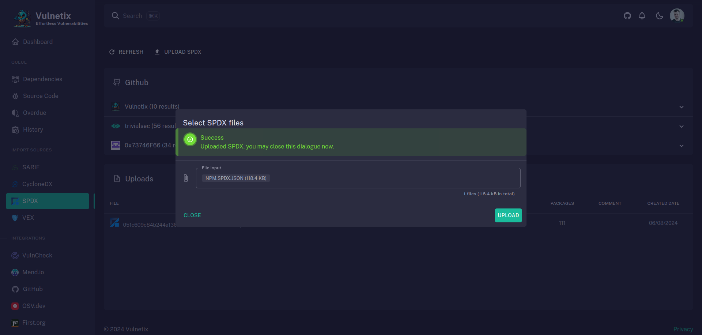

# Triage, by Trivial Security

Your Comprehensive Vulnerability Management Tool to automate decision and resolution reporting

Triage aims to provide a robust and flexible vendor independent solution for managing vulnerabilities, ensuring your applications remain secure and compliant with industry standards.

## GitHub App (WIP) available for early testers

[GitHub App Marketplace listing](https://github.com/marketplace/triage-by-trivial-securiy)

## Screenshots

Check the marketplace listing above for more.

## Features

Triage will offer a range of features to streamline vulnerability management:

1. **SBOM**: The app takes input data from SPDX, and CycloneDX.
2. **Data Enrichment**: Users can add optional API keys to enrich their data.
3. **Policy and Compliance**: Ensures policy and compliance adherence using OSCAL.
4. **SAST**: Ingestion of SARIF format SAST scanner outputs.
5. **GitHub App**: Provides an optional integration interface for SBOM, SPDX, and SCA Dependabot alerts.
6. **Cloud Dashboard**: Offers a cloud-based dashboard for reporting and manual SBOM uploads.
7. **VEX**: Utilizes git commit messages following conventional commit messages for VEX creation.
8. **Auditing**: Enable all auditing actions resulting in a VEX through the cloud dashboard.
9. **Standardized Reporting**: All reporting in the cloud dashboard uses SARIF, CycloneDX, and VEX formats, ensuring compatibility with modern tools and avoiding vendor lock-in. Tools producing SBOMs are considered modern, while others are regarded as legacy and need modernization.

## Vulnerability Management

Triage is designed to handle various aspects of vulnerability management effectively. Here are the key data points the app processes:

1. **Fix Intel**: Determines if patching the issue is possible or if fixing requires coding.
2. **Patch Availability**: Checks if a patch is available now.
3. **Auto Patch**: Automatically opens a pull request for available patches.
4. **Non-breaking changes**: Ensures auto patches are possible without causing breaking changes.
5. **Vulnerability Enrichment**: Enhances data from CPE, CISA KEV, and published exploit PoCs.
6. **Code Reachability**: Assesses the reachability of vulnerable code within the application.
7. **Exploit Status and Maturity**: Tracks the status and maturity of exploits.
8. **Exploitation Awareness**: Monitors if vulnerabilities are known to be exploited via VulnCheck KEV or CISA KEV.
9. **Exploitation Forecast**: Predicts exploitation expectations over the next 30 days using EPSS.
10. **Triage Decisions**: Makes triage decisions using the SSVC framework.
